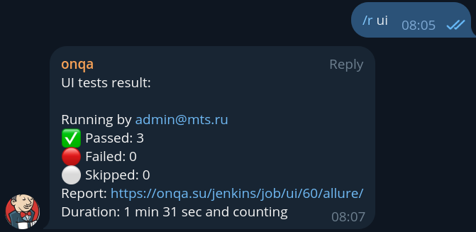

#### Описание проектной работы:

- [Схема инфраструктуры](infra/docs/infra-schema.md)
- [goGridRouter ui](https://onqa.su/)
- [Видосы пройденных ui тестов](https://onqa.su/video/)
- [Jenkins](https://onqa.su/jenkins/) -> admin:admin
- Запуск тестов возможен из Jenkins'а
- Запуск тестов возможен из чата в telegram (через shellbot)
- 
- Поднимать окружение на локали лучше через скрипт командой:
```bash
cd infra && ./restart.sh
```

#### Может пригодиться:
- [Локальный запуск окружения вручную](infra/docs/create_docker_run.md)
- [Локальный запуск окружения композом](infra/docs/create_docker_compose.md)
- [Jenkins со своим dataVolume из docker Hub](https://github.com/onemoreqa/JenkinsImageTutorial)