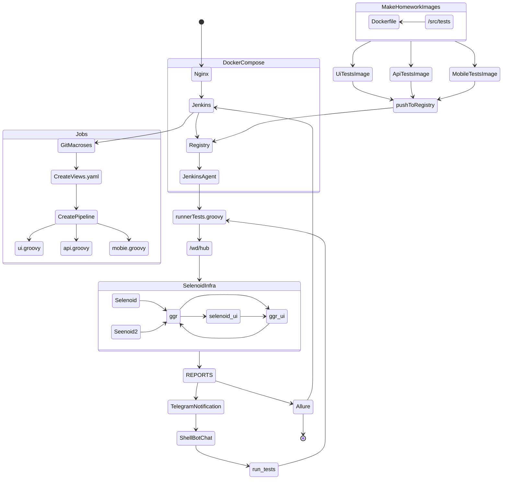

```mermaid
stateDiagram
    direction TB
    [*] --> Nginx
    state DockerCompose {
        direction LR
        Nginx --> Jenkins
        Jenkins --> Registry
        Registry --> JenkinsAgent
    }
    
    state MakeHomeworkImages {
    direction RL
    /src/tests --> Dockerfile
    }
    MakeHomeworkImages --> UiTestsImage
    MakeHomeworkImages --> ApiTestsImage
    MakeHomeworkImages --> MobileTestsImage
    UiTestsImage --> pushToRegistry
    ApiTestsImage --> pushToRegistry
    MobileTestsImage --> pushToRegistry
    pushToRegistry --> Registry
    runnerTests.groovy --> /wd/hub
    JenkinsAgent --> runnerTests.groovy

    /wd/hub --> SelenoidInfra
    state SelenoidInfra {
        direction LR
        Selenoid --> ggr
        Seenoid2 --> ggr
        ggr --> ggr_ui
        ggr_ui --> ggr
        ggr --> selenoid_ui 
        selenoid_ui --> ggr_ui
    }
    SelenoidInfra --> REPORTS
    REPORTS --> TelegramNotification
    TelegramNotification --> ShellBotChat
    ShellBotChat --> run_tests
    run_tests --> runnerTests.groovy
REPORTS --> Allure
    Allure --> Jenkins
    Allure --> [*]

    state Jobs {
        direction LR
        GitMacroses --> CreateViews.yaml
        CreateViews.yaml --> CreatePipeline
        CreatePipeline --> ui.groovy
        CreatePipeline --> api.groovy
        CreatePipeline --> mobie.groovy
    }
    Jenkins --> GitMacroses
    
```